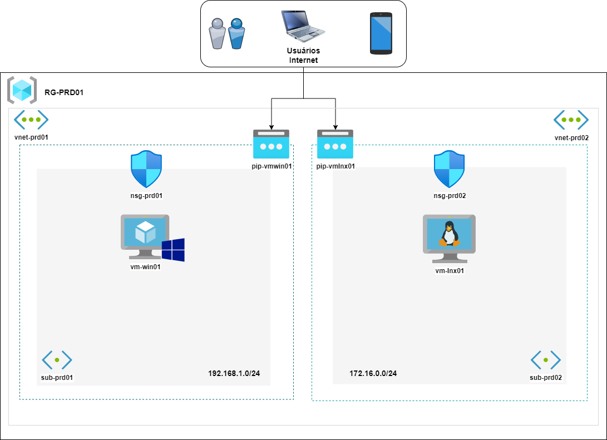

# Arquitetura do Projeto *azure-terraform*

## Serão criados os seguintes recursos pelo terraform:
* Resource Group chamado *"RG-PRD01"* que será armazenado na Região "eastus2"

* Criação de uma estrutura de Rede Virtual com os seguintes recursos: 
  -  Virtual Network para VM Windows chamada *"vnet-prd01"*
  -  Virtual Network para VM Linux chamada *"vnet-prd02"*
  -  Subnet para VM Windows chamada *"sub-prd01"*
  -  Subnet para VM Linux chamada *"sub-prd02"*
  -  Network security group chamado *"nsg-prd01"* para VM Windows
  -  Network security group chamado *"nsg-prd02"* para VM Linux
  -  IP Público para acessar a VM Windows chamado *"pip-vmwin01"*
  -  IP Público para acessar a VM Linux chamado *"pip-vmlnx01"*
  -  Controlador de interface de rede chamado *"nic-vm-win01"* para VM Windows
  -  Controlador de interface de rede chamado *"nic-vm-lnx01"* para VM Windows

* Criar uma Máquina Virtual para provisionar o Windows

* Criar uma Máquina Virtual para provisionar o Linux
